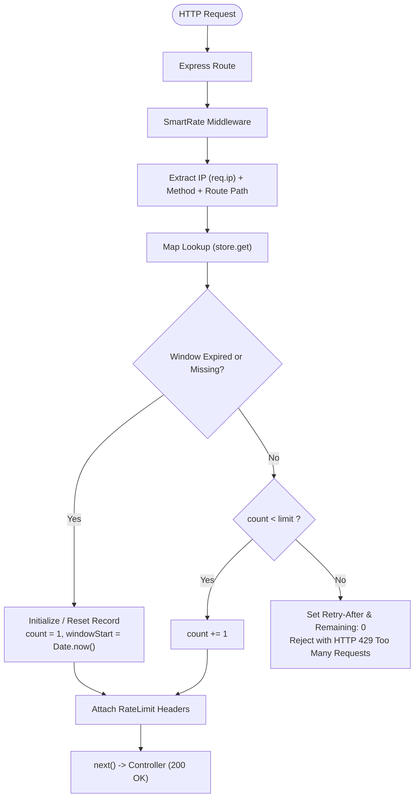

# SmartRate

A lightweight, in-memory rate limiting middleware for Express.js using the Fixed Window algorithm. SmartRate has zero production runtime dependencies (requiring only Express as a peer dependency).

SmartRate helps mitigate brute-force attempts and request spam by throttling requests per IP address across isolated routes and HTTP methods.

> **Repository Note:** The project is named **SmartRate** (npm package `smart-rate`), hosted in the [RateShield](https://github.com/Anivesh91/RateShield) repository.

```javascript
import express from 'express';
import { rateLimiter } from 'smart-rate';

const app = express();

app.post(
  '/api/login',
  rateLimiter({ limit: 5, windowMs: 60_000 }),
  loginController
);
```

---

## Why SmartRate?

Most existing rate-limit packages either bundle heavy distributed store drivers or pull in complex dependency trees. SmartRate was built to provide a clean, readable in-memory rate limiter with zero production runtime dependencies that adheres to modern ES Modules and handles route isolation out of the box.

### Features
- **Fixed Window Counter**: Strict boundary enforcement with zero off-by-one errors.
- **Method & Route Isolation**: Independent counters for different routes and HTTP methods on the same IP (`127.0.0.1:GET:/api/users` vs `127.0.0.1:POST:/api/users`).
- **Query Stripping**: Automatically normalizes route paths so `/items?page=1` and `/items?page=2` share the same quota bucket.
- **Fail-Fast Validation**: Throws descriptive `RangeError` / `TypeError` at startup if misconfigured.
- **Rate-Limit Response Headers**: Emits `RateLimit-Limit`, `RateLimit-Remaining`, `RateLimit-Reset`, and `Retry-After`.
- **Stale Entry Sweeper**: Uses `timer.unref()` to periodically evict expired records without hanging the Node.js event loop during test teardown or graceful shutdowns.

---

## Architecture

The repository separates the reusable middleware from the demonstration application:

```text
smart-rate-limiter/
├── src/                                  # Core Library
│   ├── limiter/
│   │   └── rateLimiter.js                # Fixed Window engine & header injection
│   └── index.js                          # Public entry point
│
├── examples/                             # Demo Consumer Application
│   └── express-demo/
│       ├── controllers.js
│       ├── routes.js
│       ├── app.js
│       └── server.js
│
├── tests/
│   └── rateLimiter.test.js               # Integration test suite
│
├── package.json
└── README.md
```

### Request Lifecycle



---

## State Model

Runtime state is held in a module-level `Map`:

```javascript
Map {
  "127.0.0.1:GET:/api/test"  => { count: 3, windowStart: 1727000000000, windowMs: 60000 },
  "127.0.0.1:POST:/api/login" => { count: 1, windowStart: 1727000010000, windowMs: 60000 }
}
```

- Keys combine `clientIp`, `req.method`, and the normalized route path (`req.originalUrl.split('?')[0]`).
- Records store `windowMs` so a single background sweeper can clean records across different route policies.

---

## Getting Started

### Installation

```bash
git clone https://github.com/Anivesh91/RateShield.git
cd RateShield
npm install
```

### Running the Demo

Start the demo server with Node's native watcher:

```bash
npm run dev
```

The demo runs at `http://localhost:3000` with three distinct policies:
- `GET  /api/test`   — 5 requests / 60s
- `POST /api/login`  — 3 requests / 60s
- `GET  /api/public` — 10 requests / 60s

---

## Rate-Limit Response Headers

Every rate-limited route attaches informative response metadata:

| Header | Example | Description |
| :--- | :--- | :--- |
| `RateLimit-Limit` | `5` | Request allowance within the active window |
| `RateLimit-Remaining` | `3` | Remaining requests allowed in this window (never negative) |
| `RateLimit-Reset` | `42` | Seconds remaining until window resets (countdown) |
| `Retry-After` | `42` | *(Sent on 429 only)* Seconds to wait before retrying |

### Example Blocked Response (429)

```http
HTTP/1.1 429 Too Many Requests
Content-Type: application/json; charset=utf-8
RateLimit-Limit: 5
RateLimit-Remaining: 0
RateLimit-Reset: 35
Retry-After: 35

{
  "success": false,
  "message": "Too many requests",
  "retryAfter": 35
}
```

---

## Testing

Run the automated test suite powered by Supertest and Node's native `node:test` runner:

```bash
npm test
```

### Verified Test Cases
1. Fail-fast option validation (`limit <= 0`, non-integer, non-finite `windowMs`).
2. First request is allowed.
3. Exactly N requests are allowed.
4. Request N+1 returns 429.
5. `RateLimit-Limit` is correct.
6. `RateLimit-Remaining` decreases correctly.
7. `RateLimit-Remaining` never drops below 0 across multiple blocked requests.
8. `RateLimit-Reset` countdown exists.
9. `Retry-After` exists on blocked responses.
10. Window expiration allows requests again.
11. Different routes are isolated.
12. Query parameters do not create separate quota buckets.
13. Different client IPs on the same route are strictly isolated.
14. GET and POST on the same path maintain independent rate-limit counters.
15. `cleanupExpiredRecords()` actually evicts expired records from memory.
16. Demo endpoints enforce their configured limits accurately.

---

## Current Limitations & Roadmap

### Current v1 Constraints
- **In-Memory / Volatile**: State is stored in RAM and resets when the Node process restarts.
- **Single Process**: Multiple cluster workers or server instances do not share state.
- **Fixed Window Boundary Bursts**: A burst can occur around a client's window boundary when requests are sent immediately before and after that window resets.
- **IP Identification**: Behind reverse proxies (Nginx, Cloudflare, AWS ALB), Express `trust proxy` must be properly configured to prevent IP spoofing.
- **Same Method + Route Multi-Policy Stacking**: Because the shared store keys on `IP:method:route`, attaching multiple distinct rateLimiter() instances to the exact same method and route path would share state.

### Roadmap (v2)
- Redis backing via `ioredis` for multi-instance distributed deployments.
- Sliding Window Counter algorithm to smooth out boundary bursts.
- Custom key generators (rate limit by API key, User ID, or JWT claim).
- Route template normalization for dynamic parameters (`/users/:id`).
- Configurable fail-open / fail-closed behavior on store errors.
