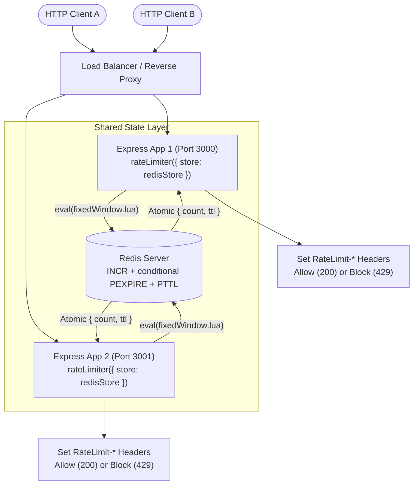
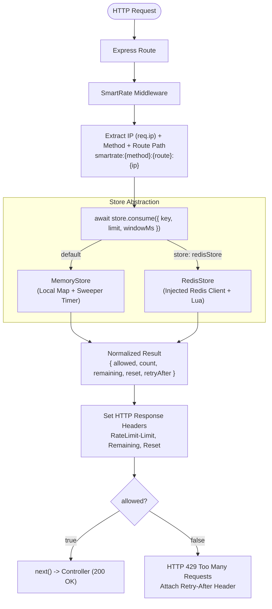

# SmartRate

A production-ready rate limiting middleware for Express.js using the Fixed Window algorithm. SmartRate supports both lightweight, zero-dependency in-memory rate limiting and distributed, atomic Redis-backed rate limiting across multiple application instances.

> **Repository Note:** The project is named **SmartRate** (npm package `smart-rate`), hosted in the [RateShield](https://github.com/Anivesh91/RateShield) repository.

```javascript
import express from 'express';
import { rateLimiter } from 'smart-rate';

const app = express();

// Zero-config: defaults to in-memory store
app.post(
  '/api/login',
  rateLimiter({ limit: 5, windowMs: 60_000 }),
  loginController
);
```

---

## Architecture Overview

SmartRate v2 introduces a pluggable store architecture decoupling the Express HTTP layer from rate-limit state management.

### Multi-Instance Distributed Architecture

In distributed environments, multiple Node.js instances share a single rate-limit state in Redis. Atomic Lua script execution ensures exact quota enforcement without cross-instance race conditions.



### Request Lifecycle



---

## Features

- **Dual Storage Engines**:
  - `MemoryStore`: Fast, local in-memory storage with zero runtime dependencies. Includes an unref'd background sweeper for stale records.
  - `RedisStore`: Shared state across multiple server instances with native Redis TTL expiration.
- **Atomic Lua Execution**: Rate limit state transitions (`INCR` -> conditional `PEXPIRE` -> `PTTL`) execute atomically inside Redis, preventing command interleaving and eliminating the client-side zombie key failure window.
- **Dependency Injection**: `RedisStore` receives a pre-connected Redis client. Connection setup, configuration, and graceful shutdown are owned cleanly by the application.
- **Strict Method & Route Isolation**: Independent counters for different routes and HTTP methods on the same IP (`smartrate:GET:/api/users:127.0.0.1` vs `smartrate:POST:/api/users:127.0.0.1`).
- **Query Stripping**: Normalizes route paths so `/items?page=1` and `/items?page=2` share the exact same quota bucket.
- **Fail-Fast Validation**: Throws descriptive errors at startup on invalid `limit` or `windowMs`.
- **Standard Rate-Limit Headers**: Emits `RateLimit-Limit`, `RateLimit-Remaining`, `RateLimit-Reset`, and `Retry-After`.
- **100% Backwards Compatible**: Existing v1 code requires zero modifications to upgrade to v2.

---

## Storage Engines Comparison

| Feature | `MemoryStore` | `RedisStore` |
| :--- | :--- | :--- |
| **State Location** | Local Node.js process memory (`Map`) | Shared Redis server |
| **Dependencies** | None (zero runtime dependencies) | `redis` client |
| **Multi-Instance Support**| No (each instance has isolated state) | Yes (shared quota across all instances) |
| **Key Expiration** | Background interval sweeper (`timer.unref()`) | Native Redis `PEXPIRE` / TTL |
| **Process Crash State** | State is lost on restart | State persists across process restarts |
| **Use Case** | Single-instance apps, development, testing | Production clusters, multi-container deployments |

---

## Usage Guide

### 1. In-Memory Mode (Default / v1 Compatible)

By default, omitting the `store` option uses `MemoryStore`. No Redis instance or additional configuration is required:

```javascript
import express from 'express';
import { rateLimiter } from 'smart-rate';

const app = express();

app.get(
  '/api/public',
  rateLimiter({
    limit: 10,
    windowMs: 60_000
  }),
  (req, res) => res.json({ success: true })
);
```

### 2. Distributed Redis Mode (Multi-Instance)

To share rate-limit counters across multiple instances, instantiate `RedisStore` and inject a connected Redis client:

```javascript
import express from 'express';
import { createClient } from 'redis';
import { rateLimiter, RedisStore } from 'smart-rate';

const app = express();

// 1. Create and connect Redis client (application owns connection lifecycle)
const redisClient = createClient({
  url: process.env.REDIS_URL || 'redis://localhost:6379'
});

await redisClient.connect();

// 2. Inject connected client into RedisStore
const store = new RedisStore({ client: redisClient });

// 3. Configure rate limiter with shared store
const limiter = rateLimiter({
  limit: 5,
  windowMs: 60_000,
  store
});

app.post('/api/login', limiter, (req, res) => {
  res.json({ success: true });
});
```

### 3. Application Lifecycle & Graceful Shutdown

Because `RedisStore` uses dependency injection, the consumer application manages process signals (`SIGINT`, `SIGTERM`), draining HTTP connections before closing the Redis client:

```javascript
const server = app.listen(3000);

async function shutdown(signal) {
  console.log(`Received ${signal}. Shutting down gracefully...`);
  server.close(async () => {
    await redisClient.quit();
    process.exit(0);
  });
}

process.on('SIGINT', () => shutdown('SIGINT'));
process.on('SIGTERM', () => shutdown('SIGTERM'));
```

---

## Technical Deep Dive: Redis & Lua Atomicity

### The Multi-Command Problem (Non-Atomic Baseline)

In naive Redis rate limiting implementations, the client executes multiple sequential commands from Node.js:

```text
Node.js                      Redis
  │   1. INCR key              │
  ├───────────────────────────>│ (count = 1)
  │                            │
  │   2. PEXPIRE key windowMs  │  <-- Crash or network failure here leaves
  ├───────────────────────────>│      a key with NO expiry ("zombie key")
  │                            │
  │   3. PTTL key              │
  ├───────────────────────────>│
```

This sequence suffers from two critical flaws:
1. **The Zombie Key Failure Window**: If the application crashes, restarts, or loses connectivity after `INCR` but before `PEXPIRE`, the counter key is created with **no expiration** (`TTL = -1`). That IP address is permanently tracked and blocked indefinitely.
2. **Command Interleaving Under Concurrency**: When concurrent requests arrive simultaneously across instances, individual commands interleave, causing inaccurate TTL reads or race conditions during the initial window creation.

### The Lua Solution in SmartRate v2

SmartRate v2 bundles [`src/scripts/fixedWindow.lua`](file:///d:/Desktop/WEB%20DEVELOPMENT/rateshield/src/scripts/fixedWindow.lua), executing the state transition directly on the Redis engine:

```lua
local count = redis.call("INCR", KEYS[1])
if count == 1 then
    redis.call("PEXPIRE", KEYS[1], ARGV[1])
end
local ttl = redis.call("PTTL", KEYS[1])
return {count, ttl}
```

#### Precise Atomicity Guarantees
- **No Command Interleaving**: Redis executes the Lua script atomically with respect to other Redis commands. No other script or command executes while the Lua script is running.
- **Zombie Key Prevention**: The script guarantees that `PEXPIRE` is called immediately when `count == 1` within the same execution context. The client-side failure window is eliminated.
- **Transactional Rollback Note**: Redis Lua provides non-interleaving atomic isolation, but does not provide relational-style rollback if a runtime command inside the script fails (e.g. data type mismatch). SmartRate guards against this by using well-defined key strings and integer arguments.

---

## Rate-Limit Response Headers

Every rate-limited route attaches standard HTTP rate-limiting headers:

| Header | Example | Description |
| :--- | :--- | :--- |
| `RateLimit-Limit` | `5` | Maximum request quota within the active window |
| `RateLimit-Remaining` | `3` | Remaining requests allowed in this window (never drops below 0) |
| `RateLimit-Reset` | `42` | Seconds remaining until the active window resets |
| `Retry-After` | `42` | *(Emitted on HTTP 429 only)* Seconds the client must wait before retrying |

### Example Blocked Response (HTTP 429)

```http
HTTP/1.1 429 Too Many Requests
Content-Type: application/json; charset=utf-8
RateLimit-Limit: 5
RateLimit-Remaining: 0
RateLimit-Reset: 35
Retry-After: 35

{
  "success": false,
  "message": "Too many requests",
  "retryAfter": 35
}
```

---

## Running the Multi-Instance Demo

The repository includes a runnable demonstration showing two independent Express instances sharing a single rate-limit quota via Redis:

```bash
# Ensure local Redis is running (default: redis://localhost:6379)
node examples/express-demo/multi-instance.js
```

This starts:
- **Instance A** on `http://localhost:3000`
- **Instance B** on `http://localhost:3001`

Both instances share a quota of 5 requests per 60 seconds on `GET /api/resource`. Requests sent to Instance A consume the quota for subsequent requests sent to Instance B.

---

## Testing & Verification

SmartRate v2 includes a comprehensive test suite covering unit tests, integration tests, concurrency verification, and distributed multi-instance sharing:

```bash
npm test
```

### Test Suites

1. **`tests/rateLimiter.test.js`** (12 tests)
   - Fail-fast parameter validation (`limit <= 0`, non-integer, non-finite `windowMs`).
   - First request allowance and exact N limit boundary.
   - HTTP 429 blocking and header verification (`RateLimit-*`, `Retry-After`).
   - Route, HTTP method, and client IP isolation.
   - Query string stripping.
   - Window expiration and reset behavior.
   - Asynchronous custom store support and Express error forwarding.
2. **`tests/memoryStore.test.js`** (5 tests)
   - Store record initialization, sequential increments, and reset.
   - Unref'd background sweeper verification for expired record cleanup.
   - Key isolation.
3. **`tests/redisStore.test.js`** (9 tests)
   - Constructor parameter validation (missing client, invalid client).
   - Injected client dependency validation (`eval` / `sendCommand`).
   - Atomic Lua script invocation with keys and arguments.
   - Quota limit boundary enforcement (`count > limit`).
   - Defensive error handling for keys without expiration (`PTTL === -1`).
4. **`tests/redis.integration.test.js`** (3 tests)
   - Redis counter increment and TTL initialization.
   - TTL countdown and expiration reset.
   - Method isolation on RedisStore.
5. **`tests/concurrency.test.js`** (2 tests)
   - 50 concurrent requests fired via `Promise.all` against a limit of 10.
   - Asserts exact boundary enforcement (exactly 10 allowed, exactly 40 blocked with 429).
   - Verifies independent concurrent quota isolation across distinct IPs.
6. **`tests/distributed.test.js`** (2 tests)
   - Simulates two Express application instances sharing a single Redis store.
   - Verifies interleaved requests across instances share the quota and block correctly.
   - Verifies client isolation across instances.

---

## Scope Boundaries & Future Roadmap

SmartRate adheres strictly to versioned architectural boundaries:

### Implemented in SmartRate v2
- Fixed Window algorithm.
- Decoupled `MemoryStore` (in-memory) and `RedisStore` (distributed).
- Atomic Lua script execution preventing race conditions and zombie keys.
- Dependency injection for Redis client.
- 100% backwards compatibility with v1.

### Planned for Future Versions (Out of Scope for v2)
- **v3**: Sliding Window Counter and Token Bucket algorithms to eliminate boundary burst effects.
- **v4**: Custom key generators (rate limiting by API key, User ID, or JWT claims).
- **v5**: Dynamic route template normalization (`/users/:id`).
- **v6**: Circuit breakers and configurable fail-open resilience engines.
- **v7**: Prometheus and Grafana metrics instrumentation.
