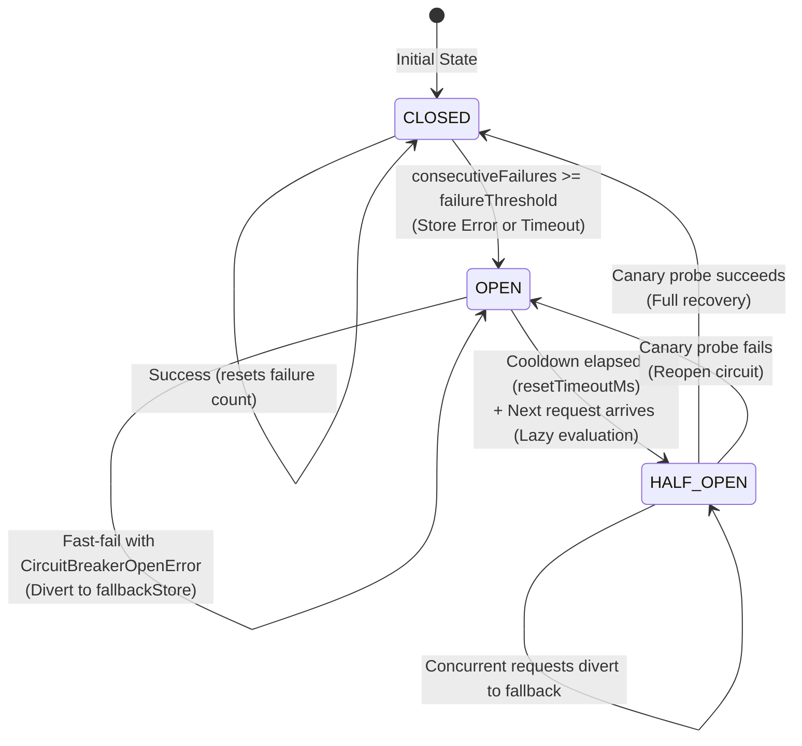

# SmartRate v7

A production-ready distributed rate limiting middleware for Express.js supporting **Full Observability (Prometheus, Grafana, OpenTelemetry)**, **High-Precision Performance Benchmarks**, **Production Resilience & Store Fault Tolerance**, **Circuit Breaker & Dual-Store Failover**, **Token Bucket + Controlled Burst**, **Rolling Sliding Window**, and **Fixed Window** algorithms, **Custom Client Identity** (API Key, User ID, Multi-Tenant), and **Dynamic Tier-Based Policies**.

SmartRate provides high-performance, zero-dependency in-memory rate limiting and distributed, atomic Redis-backed rate limiting with seamless fallback, timeout guards, and self-healing recovery.

> **Repository Note:** The project is named **SmartRate** (npm package `smart-rate`), hosted in the [RateShield](https://github.com/Anivesh91/RateShield) repository.

```javascript
import express from 'express';
import { createClient } from 'redis';
import {
  rateLimiter,
  RedisStore,
  ResilientStore,
  MemoryStore,
  createPrometheusExporter,
  OpenTelemetryBridge
} from 'smart-rate';

const app = express();
const redisClient = createClient({
  url: process.env.REDIS_URL || 'redis://localhost:6379'
});
redisClient.on('error', (error) => console.error('Redis client error:', error));
await redisClient.connect();
const loginHandler = (req, res) => res.json({ success: true });

// 1. Resilient Distributed Rate Limiter with In-Memory Fallback & Telemetry
app.use(
  '/api',
  rateLimiter({
    store: new RedisStore({ client: redisClient }),
    fallbackStore: true,         // Automatically wraps in ResilientStore with MemoryStore fallback
    timeoutMs: 250,              // Store operation timeout guard in milliseconds
    failureThreshold: 5,         // Trip circuit breaker to OPEN after 5 consecutive failures
    resetTimeoutMs: 10_000,      // Cooldown window before lazy HALF_OPEN canary probe
    limit: 100,
    windowMs: 60_000,
    metrics: true,               // Enable Prometheus telemetry collection
    openTelemetry: true          // Attach attributes & events to active OpenTelemetry span
  })
);

// 2. Token Bucket + Controlled Burst: Allows 20-request bursts, sustained 5 req/sec
app.use(
  '/api/burst',
  rateLimiter({
    algorithm: 'token-bucket',
    capacity: 20,                // Maximum burst capacity
    refillRate: 5,               // Sustained replenishment rate
    refillIntervalMs: 1000,      // Refill interval (5 tokens per 1000ms)
    keyGenerator: (req) => req.headers['x-api-key']
  })
);

// 3. Rolling Sliding Window: Strictest boundary enforcement for auth
app.post(
  '/auth/login',
  rateLimiter({
    algorithm: 'sliding-window',
    limit: 5,
    windowMs: 60_000
  }),
  loginHandler
);

// 4. Native Prometheus Scrape Endpoint (Zero External Dependencies)
app.get('/metrics', createPrometheusExporter());

app.listen(3000, () => console.log('SmartRate listening on http://localhost:3000'));
```

Start Redis before running this example. Once the server is running, stopping Redis demonstrates the configured fallback behavior; start it again to observe recovery.

---

## What's New in SmartRate v7 (Observability & Performance)

SmartRate v7 answers the core production question: **"What is SmartRate doing in production, and how can developers observe its health and performance?"**

* **Zero-Dependency Native Prometheus Exposition (`/metrics`)**:
  - Exposes metrics adhering strictly to the Prometheus text exposition format (v0.0.4) without requiring `prom-client` or any third-party runtime package.
  - Mount via `app.get('/metrics', createPrometheusExporter())` or serialize programmatically with `formatPrometheusMetrics(snapshot)`.
* **In-Memory Metrics Engine (`MetricsCollector`)**:
  - Tracks throughput outcomes (`smartrate_requests_total` with `outcome="allowed"|"blocked"`), store latencies (`smartrate_store_duration_seconds`), store error counts (`smartrate_store_errors_total`), and circuit breaker state gauge (`smartrate_circuit_breaker_state`).
* **Strict Route Cardinality Guard (`normalizeRoute`, `sanitizePath`)**:
  - Automatically collapses dynamic entity IDs (`/users/42` or `/orders/550e8400...`) to `/users/:id` to protect Prometheus TSDB from label explosion. User IDs and IPs are strictly excluded from metric labels.
* **Failure-Isolated Telemetry Boundary**:
  - Telemetry operations run inside safe error boundaries. A telemetry error or full metrics buffer **never** disrupts client HTTP requests.
* **Duck-Typed OpenTelemetry Tracing Bridge (`OpenTelemetryBridge`)**:
  - Automatically enriches active request spans with rate limiting attributes (`smartrate.outcome`, `smartrate.algorithm`, `smartrate.route`, `smartrate.remaining`, `smartrate.reset`) and emits `smartrate.rate_limit_exceeded` span events without making `@opentelemetry/api` a mandatory dependency.
* **Production Grafana Dashboard Asset**:
  - Pre-built, importable Grafana dashboard JSON (`assets/dashboards/smartrate-grafana-dashboard.json`) featuring live throughput, block rate ratio gauge, circuit breaker state, and latency percentiles.
* **Production Alertmanager Rules**:
  - Standard Prometheus alerting rules (`assets/alerts/prometheus-rules.yml`) for High Block Rate (> 25%), Store Outages, Circuit Breaker trips, and High Store Latency (p95 > 50ms).
* **High-Precision Performance Benchmarking CLI (`npm run benchmark`)**:
  - Measures realistic overhead using `process.hrtime.bigint()` across 6 scenarios with 1,000 warmups + 10,000 requests each.
  - **Empirical result:** In-memory evaluation adds only **~2.3 to 3.7 microseconds** (`< 0.004 ms`) at p50. Real microseconds measured, zero false "zero overhead" marketing claims.

---

## What's New in SmartRate v6

SmartRate v6 solves the most critical operational failure mode of distributed rate limiting: **What happens when Redis or the central store becomes unavailable, slow, or network-partitioned?**

* **Store Timeout Guard (`timeoutMs`, `withTimeout`, `StoreTimeoutError`)**:
  - Enforces bounded operation latency on all store calls.
  - Prevents slow Redis instances or stalled network sockets from exhausting Node.js event-loop queues or cascading into HTTP 504 gateway timeouts.
  - If a store call exceeds `timeoutMs` (default 250ms), a `StoreTimeoutError` is raised promptly, triggering the configured failure policy.
* **Store Failure Policies (`onStoreError`)**:
  - `'fail-open'` (default): Requests bypass rate limiting cleanly during catastrophic failures, prioritizing maximum service availability.
  - `'fail-closed'`: Requests are rejected with `HTTP 503 Service Unavailable` and dynamic `Retry-After`, protecting upstream infrastructure under heavy load.
  - Custom function `(err, req, res, next)`: Allows custom fallback logging, error reporting, or alternate routing.
* **Circuit Breaker Engine (`CircuitBreaker`, `CIRCUIT_STATE`)**:
  - Implements a resilient 3-state finite state machine (`CLOSED`, `OPEN`, `HALF_OPEN`).
  - **Lazy On-Demand Transitions**: State changes from `OPEN` to `HALF_OPEN` do not use background timers or unreferenced intervals. Transitions are evaluated lazily on the next incoming request once cooldown has elapsed.
  - **Zero Store Hammering**: When in `OPEN` state, store calls are 100% bypassed (`CircuitBreakerOpenError`), preventing thundering herd problems against recovering databases.
  - **Single-Flight Canary Probe**: In `HALF_OPEN`, exactly one canary probe is dispatched to test store health. Concurrent incoming requests are safely diverted to the fallback store.
  - **Precise Failure Classification**: The breaker only records infrastructure failures (network timeouts, socket drops, store crashes). Rate limit rejections (`429`), invalid options, and application errors never trip the breaker.
* **Dual-Store Resilience Engine (`ResilientStore`)**:
  - Combines a primary distributed store (e.g. `RedisStore`) with a fast local fallback store (e.g. `MemoryStore`).
  - Provides the shorthand configuration `fallbackStore: true` in `rateLimiter(...)`.
  - While degraded, the fallback store **strictly enforces local rate limits**, preventing unmetered traffic surges from crashing backend applications.
* **Architectural Boundaries Strictly Maintained**:
  - **No State Sync / Backfill**: When Redis recovers, local memory counters are **NOT** synchronized or backfilled into Redis. Local state expires naturally according to TTL.
  - **Per-Process Degradation Semantics**: In a multi-node cluster, degraded memory limits apply per process ($N \times \text{limit}$).
* **Observability & Degraded Header Tagging**:
  - Attaches `RateLimit-Degraded: true` HTTP response header whenever fallback is engaged.
  - Exposes `req.rateLimit` metadata object with `{ degraded, fallbackUsed, store, primaryError }` for application logging and OpenTelemetry/APM spans.

---

## Resilience Architecture

```mermaid
flowchart TD
    Req([Incoming HTTP Request]) --> Limiter[SmartRate Middleware]
    Limiter --> BreakerCheck{Circuit Breaker State?}

    BreakerCheck -->|"CLOSED (Normal)"| RunPrimary[Call primaryStore with timeoutMs Guard]
    RunPrimary --> PrimarySuccess{Success?}
    PrimarySuccess -->|"Yes"| NormalResp[Set RateLimit-* Headers<br/>degraded: false<br/>next()]
    PrimarySuccess -->|"Timeout / Error"| RecordFail[Record Failure in Breaker]
    RecordFail --> FallbackHop[Failover to fallbackStore]

    BreakerCheck -->|"OPEN (Tripped)"| SkipPrimary[Bypass primaryStore<br/>Zero Network Hammering]
    SkipPrimary --> FallbackHop

    BreakerCheck -->|"HALF_OPEN (Cooldown Passed)"| ProbeInFlight{Canary Probe In-Flight?}
    ProbeInFlight -->|"No (Canary Flight)"| RunCanary[Dispatch Single-Flight Canary to primaryStore]
    ProbeInFlight -->|"Yes (Concurrent)"| FallbackHop

    RunCanary --> CanaryResult{Canary Succeeded?}
    CanaryResult -->|"Yes"| CloseBreaker[Transition to CLOSED<br/>Resume primaryStore]
    CanaryResult -->|"No"| ReopenBreaker[Transition to OPEN<br/>Reset Cooldown]
    CloseBreaker --> NormalResp
    ReopenBreaker --> FallbackHop

    FallbackHop --> RunFallback[Execute fallbackStore.consume]
    RunFallback --> FallbackQuota{Local Quota Exceeded?}
    FallbackQuota -->|"No"| AllowDegraded[HTTP 200 OK<br/>RateLimit-Degraded: true]
    FallbackQuota -->|"Yes"| BlockDegraded[HTTP 429 Too Many Requests<br/>RateLimit-Degraded: true]
```

---

## Circuit Breaker State Transitions



---

## Algorithm Comparison Matrix

| Dimension | Fixed Window (`'fixed-window'`) | Sliding Window (`'sliding-window'`) | Token Bucket (`'token-bucket'`) |
| :--- | :--- | :--- | :--- |
| **Boundary Burst Prevention** | ❌ Prone to $2 \times N$ bursts at boundaries | ✅ **Strictly eliminated** in rolling window | ✅ **Controlled burst** up to `capacity`, sustained by `refillRate` |
| **Traffic Shaping** | Hard reset each window | Rolling window cutoff | **Continuous smooth refill** over time |
| **Refill Schedule** | Window duration (`windowMs`) | Rolling interval (`windowMs`) | **Custom interval** (`refillIntervalMs`, default 1s) |
| **Memory Complexity** | **$O(1)$** per key (counter + timestamp) | **$O(N)$** per key ($N$ timestamps in ZSET) | **$O(1)$** per key (tokens + lastRefill hash) |
| **HTTP Reset Semantics** | Window expiry boundary | Oldest rolling timestamp eviction | **Option C**: Time to full burst (allowed) or next request (429) |
| **Redis Data Structure** | String counter (`INCR`) | Sorted Set (`ZSET`) | Hash (`HMGET` / `HSET`) + Atomic Lua |
| **Fault Tolerance** | Supported via `ResilientStore` | Supported via `ResilientStore` | Supported via `ResilientStore` |
| **Recommended Use Case** | Coarse public DDoS prevention | High-security auth / login endpoints | **SaaS APIs, bursty frontends, background webhook queues** |

---

## Configuration Reference

### Resilience & Store Options (v6)

```javascript
app.use(
  rateLimiter({
    // Store configuration
    store: redisStore,                  // Primary store (defaults to new MemoryStore())
    fallbackStore: true,                // Set true to auto-wrap with MemoryStore fallback, or pass custom store
    
    // Timeout Guard
    timeoutMs: 250,                     // Max execution time per store call (default: 250ms)
    
    // Store Failure Strategy (when no fallbackStore is configured)
    onStoreError: 'fail-open',          // 'fail-open' (default), 'fail-closed', or custom (err, req, res, next)
    
    // Circuit Breaker Options
    circuitBreaker: true,               // Enable breaker (default: true when options configured)
    failureThreshold: 5,                // Consecutive errors to trip breaker (default: 5)
    resetTimeoutMs: 10_000,             // Cooldown duration before canary probe (default: 10,000ms)
    successThreshold: 1,                // Consecutive canary successes to close breaker (default: 1)
    
    // Algorithm & Identity
    algorithm: 'token-bucket',          // 'token-bucket' | 'sliding-window' | 'fixed-window'
    capacity: 20,
    refillRate: 5,
    refillIntervalMs: 1000,
    keyGenerator: (req) => req.headers['x-api-key'] || req.ip
  })
);
```

### Response Headers Reference

| Header | Example | Description |
| :--- | :--- | :--- |
| `RateLimit-Limit` | `100` | Quota boundary for the active algorithm |
| `RateLimit-Remaining` | `94` | Tokens or requests remaining in current window |
| `RateLimit-Reset` | `12` | Seconds until quota replenishment or next retry eligibility |
| `Retry-After` | `30` | *(HTTP 429 & 503 only)* Seconds client must sleep before retrying |
| `RateLimit-Degraded` | `true` | Indicates a store failure or timeout. A configured fallback store enforces its own quota; with `fail-open` and no fallback, the request proceeds without rate limiting. This header does not by itself mean fallback quota enforcement is active. |

---

## Demos & Interactive Scripts

### 1. Production Outage & Resilience Demo (v6)
```bash
npm run demo:resilience
# Or: node examples/express-demo/resilience-demo.js
```
Automated CLI simulation and live Express server showcasing:
1. Normal operations on primary Redis store (200 OK, non-degraded).
2. Simulated Redis outage (`ECONNREFUSED` / latency spikes) tripping Circuit Breaker from `CLOSED` $\to$ `OPEN`.
3. Seamless failover to `ResilientStore` with `RateLimit-Degraded: true` header.
4. Safe local quota enforcement on fallback MemoryStore (returning 429 when local limit exhausted).
5. Redis recovery, cooldown expiry, single-flight canary probe in `HALF_OPEN`, and return to `CLOSED`.

### 2. Token Bucket & Burst Control Demo (v5)
```bash
npm run demo:burst
# Or: node examples/express-demo/burst-demo.js
```

### 3. SaaS Multi-Tier Dynamic Policy Demo (v4)
```bash
npm run demo:saas
# Or: node examples/express-demo/saas-demo.js
```

### 4. Fixed vs. Sliding Window Comparison Demo (v3)
```bash
npm run demo:sliding
# Or: node examples/express-demo/sliding-demo.js
```

### 5. Distributed Multi-Instance Redis Demo (v2)
```bash
npm run demo:multi
# Or: node examples/express-demo/multi-instance.js
```

---

## Verification & Test Catalog (174 Tests)

Run the full automated test suite:

```bash
npm test
```

```text
ℹ tests 174
ℹ suites 77
ℹ pass 174
ℹ fail 0
ℹ duration_ms ~2500ms
```

### Test Suites Breakdown (174 Tests across 17 Test Files)

1. **`tests/resilience.resilientStore.test.js`** (24 tests) — **[v6]**
   - Dual-Store `ResilientStore` constructor and option validation.
   - Happy-path primary execution without fallback invocation.
   - Transparent failover on infrastructure errors and timeout guard triggers.
   - Circuit breaker tripping to `OPEN` and zero primary store hammering.
   - Safe local in-memory quota degradation and 429 rejection on exhausted local quota.
   - Lazy `HALF_OPEN` transition and single-flight canary probe execution.
   - Concurrent request diversion during in-flight canary probe.
   - Seamless traffic recovery to `CLOSED` upon primary healing.
   - Express integration, automatic `RateLimit-Degraded: true` header, and `req.rateLimit` metadata.
2. **`tests/resilience.circuitBreaker.test.js`** (24 tests) — **[v6]**
   - CircuitBreaker finite state machine (`CLOSED`, `OPEN`, `HALF_OPEN`).
   - Lazy on-demand cooldown evaluation without background timers.
   - Single-flight canary token validation and generation management.
   - Failure classification isolation (network/store errors count; 429 quota exhaustion and route errors do not).
   - Dynamic `Retry-After` derivation on fail-closed 503 responses based on remaining cooldown.
3. **`tests/resilience.timeout.test.js`** (16 tests) — **[v6]**
   - `withTimeout` Promise wrapper with active timer cleanup.
   - `StoreTimeoutError` instantiation and inheritance.
   - Middleware `timeoutMs` option validation.
   - `fail-open` strategy: graceful bypass with `RateLimit-Degraded: true` and `next()`.
   - `fail-closed` strategy: HTTP 503 rejection with `RateLimit-Degraded` and dynamic `Retry-After`.
   - Custom `onStoreError` callback execution and legacy backward-compatible bubbling.
4. **`tests/tokenBucket.recovery.test.js`** (11 tests) — **[v5]**
   - Option C `RateLimit-Reset` semantics in MemoryStore and RedisStore.
   - Multi-instance distributed Token Bucket across separate client and store instances.
   - Full HTTP recovery cycle: `200 OK` (burst) $\to$ `429 Too Many Requests` $\to$ wait `Retry-After` $\to$ `200 OK`.
   - 50-request parallel burst concurrency verification under RedisStore.
5. **`tests/tokenBucket.memory.test.js`** (16 tests) — **[v4/v5]**
   - Fail-fast parameter validation for `capacity`, `refillRate`, `refillIntervalMs`.
   - Continuous in-memory refill math and capacity ceiling clamping.
   - Mathematical zero-leak memory sweeper eviction.
6. **`tests/tokenBucket.redis.test.js`** (10 tests) — **[v4/v5]**
   - Distributed Redis Token Bucket mechanics and continuous Lua refill math.
   - Safe sliding activity TTL for storage cleanup.
   - 50-request parallel concurrency stress test (zero race conditions).
7. **`tests/rateLimiter.test.js`** (14 tests) — **[v1]**
   - Option validation, Fixed Window enforcement, IP/route/method isolation.
8. **`tests/slidingWindow.memory.test.js`** (10 tests) — **[v3]**
   - In-memory rolling queue mechanics, half-open interval boundaries.
9. **`tests/redisStore.test.js`** (9 tests) — **[v2]**
   - RedisStore client injection, eval vs sendCommand fallback.
10. **`tests/keyGenerator.test.js`** (8 tests) — **[v4]**
    - Custom identity extraction, multi-tenant composite keys.
11. **`tests/dynamicPolicy.test.js`** (7 tests) — **[v4]**
    - Dynamic per-request capacity, refillRate, cost functions.
12. **`tests/distributed.test.js`** (5 tests) — **[v3]**
    - Cross-instance shared state verification across Express instances.
13. **`tests/slidingWindow.redis.test.js`** (5 tests) — **[v3]**
    - Redis Sorted Set (ZSET) atomic Lua script execution.
14. **`tests/memoryStore.test.js`** (5 tests) — **[v1]**
    - Memory store unit tests and cleanup sweepers.
15. **`tests/concurrency.test.js`** (4 tests) — **[v3]**
    - Concurrency tests for Fixed Window and Sliding Window.
16. **`tests/redis.integration.test.js`** (3 tests) — **[v2]**
    - Redis fixed window TTL and expiration.
17. **`tests/boundaryBurst.test.js`** (3 tests) — **[v3]**
    - Boundary-burst verification (fixed vs sliding window).

---

## Roadmap & Version History

* **v1.0.0**: In-memory Fixed Window rate limiter for Express.js.
* **v2.0.0**: Pluggable storage architecture, distributed `RedisStore`, and atomic Lua script execution.
* **v3.0.0**: Rolling Sliding Window (`algorithm: 'sliding-window'`) with Redis Sorted Sets (ZSET) and boundary-burst elimination.
* **v4.0.0**: Custom client identity via `keyGenerator(req)`, dynamic tier-based policies, and weighted request costs.
* **v5.0.0**: Token Bucket + Controlled Burst rate limiting (`algorithm: 'token-bucket'`), sub-second continuous refill, Option C `RateLimit-Reset`, and HTTP client recovery flow.
* **v6.0.0 (Current)**:
  - Store Timeout Guard (`timeoutMs`, `withTimeout`, `StoreTimeoutError`).
  - Configurable store failure policies (`onStoreError: 'fail-open' | 'fail-closed' | custom`).
  - Circuit Breaker Engine (`CircuitBreaker`, `CIRCUIT_STATE.CLOSED | OPEN | HALF_OPEN`).
  - Lazy on-demand cooldown state transitions (no background daemon timers).
  - Single-flight canary probe with concurrent request diversion.
  - Dual-store resilience wrapper (`ResilientStore`) with transparent fallback to `MemoryStore`.
  - Safe local in-memory quota enforcement in degraded mode (preventing downstream server collapse).
  - Explicit boundaries: zero state backfill/sync upon recovery; cluster per-process local fallback quota semantics ($N \times \text{limit}$).
  - Observability header tagging (`RateLimit-Degraded: true`) and `req.rateLimit` metadata.
  - Interactive Production Outage and Resilience Express demo (`npm run demo:resilience`).
* **v7.0.0 (Planned)**: Prometheus and OpenTelemetry metrics instrumentation.

---

## License

MIT © [Anivesh](https://github.com/Anivesh91)
