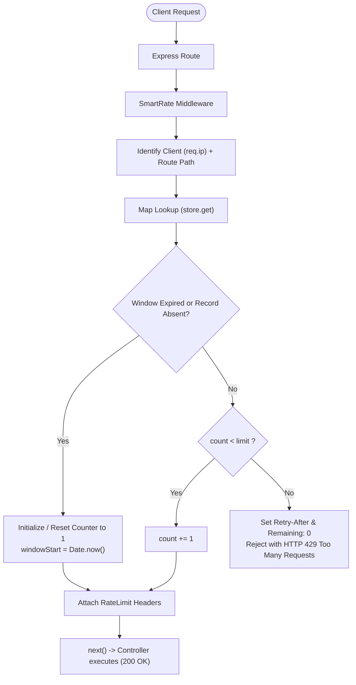

# SmartRate 🛡️

> A lightweight, reusable in-memory Fixed Window rate limiting middleware for Express.js built from scratch in modern JavaScript (ES Modules).

SmartRate protects Node.js/Express APIs against brute-force attacks, resource exhaustion, and endpoint abuse by enforcing configurable request quotas per IP address across isolated routes.

---

## 📌 Problem

Backend APIs should not accept unlimited requests from a single client. For instance, if an attacker or misconfigured script spams:

```http
POST /api/login
```

hundreds or thousands of times per minute, it causes:
- **Brute-Force & Credential Stuffing**: Automated credential guessing.
- **Resource Starvation**: High CPU, memory, and database connection consumption.
- **Degraded User Experience**: Slow response times or outages for legitimate users.
- **Uncontrolled Infrastructure Costs**: High cloud server, serverless, or third-party API bills.

---

## 🎯 What the MVP Does

SmartRate intercepts incoming HTTP requests before they reach your controllers:
1. Identifies the client using their IP address (`req.ip`).
2. Tracks active requests using an in-memory JavaScript `Map`.
3. Enforces a **Fixed Window** policy (e.g., 5 requests per 60 seconds).
4. Injects rate-limit headers (`RateLimit-Limit`, `RateLimit-Remaining`, `RateLimit-Reset`).
5. Allows requests within quota (`next()`) or blocks exceeded requests with **HTTP 429 Too Many Requests** and a `Retry-After` header.
6. Periodically evicts stale/expired records from memory.

---

## 🏗️ Library vs. Demo Application

The repository is cleanly partitioned into two distinct components:

```text
SmartRate Repository
        │
        ├── src/                 # THE ACTUAL PRODUCT (Pure Library Code)
        │   ├── limiter/
        │   │   └── rateLimiter.js
        │   └── index.js         # Public API Facade
        │
        └── examples/            # DEMO CONSUMER (Demonstration Only)
            └── express-demo/
                ├── controllers.js
                ├── routes.js
                ├── app.js
                └── server.js
```

- **`src/` (The Library)**: Contains solely the reusable middleware engine. It has zero knowledge of demo routes, business logic, or application servers.
- **`examples/express-demo/` (The Consumer)**: A small Express application that consumes SmartRate via its public API (`src/index.js`) to demonstrate and manually test different route policies.

---

## 📐 Architecture & Request Flow



---

## ⏱️ Fixed Window Algorithm

The Fixed Window algorithm tracks requests within discrete, non-overlapping time buckets:

1. **Window Duration**: Configured via `windowMs` (e.g., `60000` ms for 1 minute).
2. **Quota Tracking**:
   - **First request**: Initializes `{ count: 1, windowStart: Date.now() }` and allows `next()`.
   - **Subsequent requests within active window**:
     - If `count < limit`: Increments `count` and calls `next()`.
     - If `count >= limit`: Rejects with `HTTP 429`.
   - **Requests after window expiration** (`now - windowStart >= windowMs`): Resets `count = 1` and `windowStart = Date.now()`.

### Exact Boundary Handling (Zero Off-By-One)
For `limit = 5`:
- **Requests 1–5**: `200 OK` (Remaining decrements: `4 -> 3 -> 2 -> 1 -> 0`).
- **Request 6**: `429 Too Many Requests` (`Remaining: 0`, `Retry-After: <seconds>`).

---

## 💾 State Model & Memory Management

### In-Memory Shared Store
Runtime state is held in a module-level JavaScript `Map`:

```javascript
// Internal Key-Value Structure
Map {
  "127.0.0.1:/api/test"  => { count: 3, windowStart: 1727000000000, windowMs: 60000 },
  "127.0.0.1:/api/login" => { count: 2, windowStart: 1727000005000, windowMs: 60000 }
}
```

- **Composite Key (`clientIp:routePath`)**: Guarantees that hitting `/api/login` does not deplete quota for `/api/test`.
- **Query Stripping**: `/api/items?page=1` and `/api/items?page=2` resolve to the same route counter (`/api/items`), preventing query-string bypasses.
- **RAM Lifecycle**: State lives in V8 process heap memory. It persists across requests during server runtime, but is cleared on server restart.

### Stale Entry Cleanup (`timer.unref()`)
To prevent expired entries from accumulating indefinitely, a singleton background interval periodically scans and evicts records where `now - windowStart >= windowMs`.

```javascript
cleanupInterval.unref();
```

> **Why `unref()`?**  
> `unref()` informs the Node.js event loop that this maintenance timer alone should not prevent the Node process from exiting when all active requests/listeners finish.

---

## 📁 Project Structure

```text
smart-rate-limiter/
├── src/                                  # 🛡️ SMART-RATE LIBRARY
│   ├── limiter/
│   │   └── rateLimiter.js                # Core Fixed Window engine & headers
│   └── index.js                          # Public facade & package entry point
│
├── examples/                             # 🚗 DEMO CONSUMER APPLICATION
│   └── express-demo/
│       ├── controllers.js                # Fake demo controllers (test, login, public)
│       ├── routes.js                     # Demo routes with isolated rate policies
│       ├── app.js                        # Express app setup & trust proxy notes
│       └── server.js                     # Server runner listening on PORT
│
├── tests/
│   └── rateLimiter.test.js               # Automated test suite (Supertest + node:test)
│
├── .env                                  # Local environment variables
├── .env.example                          # Environment template (PORT=3000)
├── .gitignore                            # Standard node and environment ignores
├── package.json                          # Package configuration & scripts
└── README.md                             # Project documentation
```

---

## 🚀 Installation & Getting Started

### 1. Clone & Install Dependencies

```bash
git clone <repo-url>
cd smart-rate-limiter
npm install
```

### 2. Environment Configuration

Copy `.env.example` to `.env`:

```bash
cp .env.example .env
```

### 3. Run the Demo Server

Run with Node's native file watcher:

```bash
npm run dev
```

Or standard execution:

```bash
npm start
```

Demo endpoints will be available at `http://localhost:3000`:
- `GET  /api/test` — Limit: **5 req / 60s**
- `POST /api/login` — Limit: **3 req / 60s**
- `GET  /api/public` — Limit: **10 req / 60s**

---

## 💻 Usage Example

In any Express application:

```javascript
import express from 'express';
import { rateLimiter } from 'smart-rate';

const app = express();

// Apply route-specific rate limiting
app.post(
  '/api/login',
  rateLimiter({
    limit: 5,
    windowMs: 60_000 // 1 minute in milliseconds
  }),
  (req, res) => {
    res.json({ success: true, message: 'Login successful' });
  }
);

app.listen(3000);
```

---

## 📊 Rate-Limit Response Headers

Every protected endpoint attaches informative headers:

| Header | Example | Meaning |
| :--- | :--- | :--- |
| `RateLimit-Limit` | `5` | Total request allowance per window. |
| `RateLimit-Remaining` | `3` | Quota remaining in current window (never negative). |
| `RateLimit-Reset` | `42` | Seconds remaining until active window resets (countdown). |
| `Retry-After` | `42` | *(Sent only on HTTP 429)* Seconds the client must wait before retrying. |

### Sample Blocked Response (HTTP 429)

```http
HTTP/1.1 429 Too Many Requests
Content-Type: application/json; charset=utf-8
RateLimit-Limit: 5
RateLimit-Remaining: 0
RateLimit-Reset: 35
Retry-After: 35

{
  "success": false,
  "message": "Too many requests",
  "retryAfter": 35
}
```

---

## 🧪 Automated Testing

SmartRate includes an automated test suite verifying input validation, boundary limits, header progression, route isolation, and window reset behavior using **Supertest** and Node's built-in test runner:

```bash
npm test
```

### Test Coverage Highlights:
- ✔ Fail-fast option validation (`limit <= 0`, non-integer, non-finite `windowMs`).
- ✔ Exact request boundary: Requests 1–5 pass (`200 OK`), request 6 blocks (`429`).
- ✔ `RateLimit-Remaining` never drops below 0.
- ✔ Route isolation: IP hitting `/api/login` does not affect `/api/test`.
- ✔ Query parameters stripped to avoid limit bypass.
- ✔ Window reset: Counter resets to 1 after time window expires.
- ✔ Background stale entry cleanup sweeps elapsed records.

---

## ⚠️ Current MVP Limitations

- **Process Memory Volatility**: Counters live in RAM. Server restarts or crashes reset all counters.
- **Single-Node Only**: Multiple Node.js cluster processes or horizontal server instances do not share state.
- **Fixed Window Boundary Bursts**: A client can send $N$ requests at the end of window 1 and another $N$ requests at the start of window 2, allowing $2N$ requests in a short burst across the boundary.
- **IP Identification Only**: Clients are identified via `req.ip`. Behind proxies/CDNs, Express `trust proxy` must be configured to prevent IP spoofing.
- **No Persistent Analytics**: No historical logs or database persistence of rate-limit breaches.

---

## 🗺️ Future Roadmap (v2 & Beyond)

- [ ] **Distributed State via Redis**: Shared counters across multiple server instances using atomic operations.
- [ ] **Advanced Algorithms**: Sliding Window Log / Counter and Token Bucket algorithms to mitigate boundary bursts.
- [ ] **Custom Identifiers**: Rate limit by API Key (`x-api-key`), User ID (`req.user.id`), or custom resolver functions.
- [ ] **Route Pattern Normalization**: Handling dynamic route parameters (`/users/:id`).
- [ ] **Fail-Open Resilience**: Fallback behavior if a distributed store experiences network timeouts.
- [ ] **NPM Publishing**: Package bundling and automated CI/CD pipeline.
