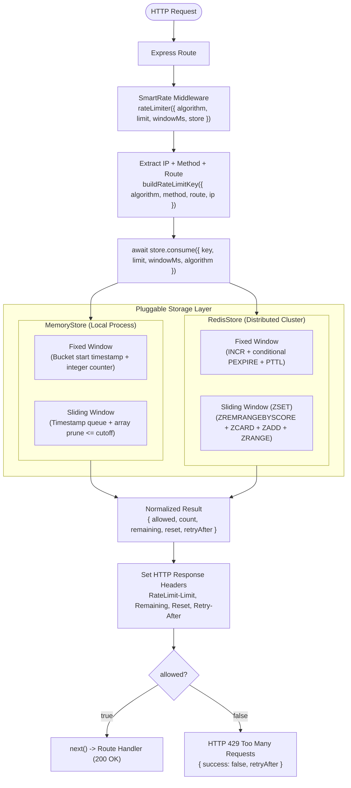
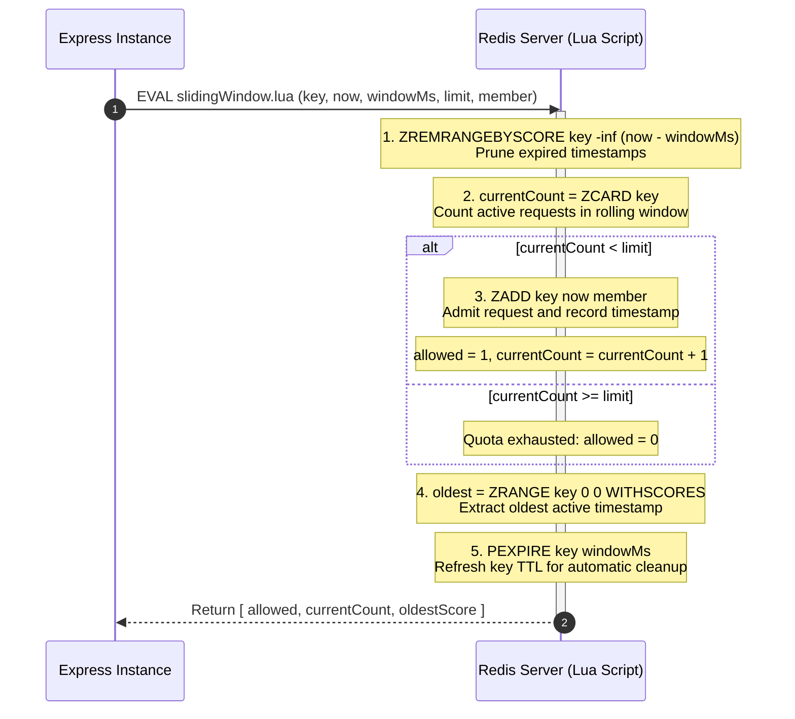

# SmartRate v3

A production-ready rate limiting middleware for Express.js supporting **Fixed Window** and **Rolling Sliding Window** algorithms. SmartRate provides high-performance, zero-dependency in-memory rate limiting and distributed, atomic Redis-backed rate limiting across multiple application instances.

> **Repository Note:** The project is named **SmartRate** (npm package `smart-rate`), hosted in the [RateShield](https://github.com/Anivesh91/RateShield) repository.

```javascript
import express from 'express';
import { rateLimiter, RedisStore } from 'smart-rate';

const app = express();

// 1. Zero-config: In-memory Rolling Sliding Window (eliminates boundary bursts)
app.post(
  '/api/login',
  rateLimiter({
    algorithm: 'sliding-window',
    limit: 5,
    windowMs: 60_000
  }),
  loginController
);

// 2. Default Fixed Window (100% backwards-compatible with v1 and v2)
app.get(
  '/api/public',
  rateLimiter({ limit: 10, windowMs: 60_000 }),
  publicController
);
```

---

## What's New in SmartRate v3

SmartRate v3 addresses the fundamental weakness of Fixed Window rate limiting: the **boundary-burst vulnerability**.

* **Sliding Window Algorithm (`algorithm: 'sliding-window'`)**: Evaluates traffic across a continuously moving half-open interval `(now - windowMs, now]`, guaranteeing that traffic never exceeds the configured quota in *any* rolling duration of length `windowMs`.
* **Atomic Redis Sorted Sets (ZSET) Engine**: Utilizes Redis ZSETs and an embedded Lua script (`src/scripts/slidingWindow.lua`) to execute pruning, counting, conditional insertion, and dynamic reset extraction in a single, non-interleaved atomic step.
* **Deterministic Member Uniqueness**: Generates `${now}:${uuid}` identifiers to ensure requests arriving in the exact same millisecond never collapse or leak quota in Redis.
* **Dynamic Reset & Retry-After Calculations**: In Sliding Window mode, `RateLimit-Reset` and `Retry-After` dynamically calculate the exact number of seconds until the oldest active timestamp slides out of the active window, avoiding artificial blocking.
* **Algorithm Key Namespacing**: State between Fixed Window (`smartrate:...`) and Sliding Window (`smartrate:sliding-window:...`) is strictly isolated, preventing Redis `WRONGTYPE` conflicts between String counters and Sorted Sets.
* **100% Backwards Compatibility**: Omitting `algorithm` defaults to `'fixed-window'`. All existing v1 and v2 configurations work without modification.

---

## The Boundary-Burst Problem & Solution

### The Vulnerability in Fixed Window

Fixed Window resets its counter at rigid bucket boundaries ($k \times \text{windowMs}$). A malicious or bursty client can send its full quota at the very end of Window 1 and send another full quota at the start of Window 2:

```text
Fixed Window: limit = 5 req / 60s
Window 1: [0s ------------------------------ 59s]  | Window 2: [60s ----------------------------- 120s]
                                      [5 requests] | [5 requests]
                                       at t = 59s  |  at t = 60.1s
                        ───► BURST: 10 requests within ~1.1 seconds! ◄───
```

Downstream services (databases, authentication microservices) experience a $2 \times N$ traffic spike, risking connection pool exhaustion and denial of service.

### The Sliding Window Solution

SmartRate v3 implements a true rolling window evaluated continuously against the current timestamp `now`:

$$\text{Active Window} = (now - \text{windowMs}, \quad now]$$

```text
Sliding Window: limit = 5 req / 60s
At t = 60.1s, the active window is (0.1s, 60.1s].
The 5 requests sent at t = 59s fall INSIDE this rolling window.
Therefore, request 6 at t = 60.1s is IMMEDIATELY BLOCKED with HTTP 429!
                        ───► Maximum 5 requests in ANY 60-second span ◄───
```

---

## Architecture Overview

SmartRate v3 cleanly decouples algorithm strategies from store engines via a unified Store contract:



---

## Technical Deep Dive: Redis Sorted Sets & Lua Atomicity

### The Redis Sliding Window Challenge

Implementing a sliding window across a distributed cluster requires:
1. Pruning timestamps older than `now - windowMs`.
2. Counting remaining entries in the window.
3. Conditionally admitting the request if count $< limit$.
4. Storing the new request timestamp if admitted.
5. Determining the oldest timestamp to compute dynamic reset time.
6. Refreshing key expiration so idle keys are evicted from Redis.

Executing these steps over separate network calls introduces race conditions where multiple server instances interleave reads and writes, resulting in quota leaks.

### Atomic Execution with `src/scripts/slidingWindow.lua`

SmartRate v3 executes all 6 operations atomically on Redis in a single script evaluation:



### Collisions & Millisecond Granularity

If two concurrent requests arrive at the exact same millisecond `now`:
* Redis ZSET entries require unique member strings; identical members update the existing entry rather than adding a new one.
* SmartRate v3 generates unique members formatted as `${now}:${crypto.randomUUID()}`.
* Both requests are stored distinctly with the exact same millisecond score `now`, preventing under-counting under heavy concurrent load.

---

## Algorithm Comparison Matrix

| Dimension | Fixed Window (`'fixed-window'`) | Sliding Window (`'sliding-window'`) |
| :--- | :--- | :--- |
| **Boundary Burst Prevention** | ❌ Prone to $2 \times N$ bursts at window boundaries | ✅ **Strictly eliminated** across any rolling window |
| **Memory Consumption** | $O(1)$ per key (single integer counter) | $O(N)$ per key ($N$ timestamps stored in queue/ZSET) |
| **Compute Overhead** | Very Low (`INCR`) | Low (`ZREMRANGEBYSCORE` + `ZCARD` + `ZADD`) |
| **Reset Calculation** | Time remaining in current fixed bucket | Dynamic time until the oldest timestamp slides out |
| **Recommended Use Case** | High-volume public endpoints, coarse DDoS protection | Strict APIs, auth/login endpoints, billing APIs |

---

## Usage Guide

### 1. In-Memory Sliding Window (Zero Redis Dependency)

```javascript
import express from 'express';
import { rateLimiter } from 'smart-rate';

const app = express();

app.post(
  '/api/auth/login',
  rateLimiter({
    algorithm: 'sliding-window',
    limit: 5,
    windowMs: 15 * 60 * 1000 // 5 requests per 15 minutes rolling
  }),
  (req, res) => res.json({ success: true })
);
```

### 2. Distributed Sliding Window with Redis

```javascript
import express from 'express';
import { createClient } from 'redis';
import { rateLimiter, RedisStore } from 'smart-rate';

const app = express();

// 1. Create and connect Redis client (application owns connection lifecycle)
const redisClient = createClient({
  url: process.env.REDIS_URL || 'redis://localhost:6379'
});
await redisClient.connect();

// 2. Inject client into RedisStore
const store = new RedisStore({ client: redisClient });

// 3. Configure Sliding Window limiter with shared store
const distributedLimiter = rateLimiter({
  algorithm: 'sliding-window',
  limit: 10,
  windowMs: 60_000,
  store
});

app.use('/api/', distributedLimiter);
```

### 3. Graceful Shutdown

```javascript
const server = app.listen(3000);

async function shutdown(signal) {
  console.log(`Received ${signal}. Shutting down gracefully...`);
  server.close(async () => {
    await redisClient.quit();
    process.exit(0);
  });
}

process.on('SIGINT', () => shutdown('SIGINT'));
process.on('SIGTERM', () => shutdown('SIGTERM'));
```

---

## Rate-Limit Response Headers

Every rate-limited route attaches standard HTTP rate-limiting headers:

| Header | Example | Description |
| :--- | :--- | :--- |
| `RateLimit-Limit` | `10` | Maximum request quota within the rolling window duration |
| `RateLimit-Remaining` | `4` | Remaining requests allowed in the rolling window (never drops below 0) |
| `RateLimit-Reset` | `12` | Seconds until the oldest active request slides out and frees a slot |
| `Retry-After` | `12` | *(Emitted on HTTP 429 only)* Seconds the client must wait before retrying |

### Example Blocked Response (HTTP 429)

```http
HTTP/1.1 429 Too Many Requests
Content-Type: application/json; charset=utf-8
RateLimit-Limit: 5
RateLimit-Remaining: 0
RateLimit-Reset: 14
Retry-After: 14

{
  "success": false,
  "message": "Too many requests",
  "retryAfter": 14
}
```

---

## Demos & Interactive Scripts

### 1. Algorithm Comparison Demo (Fixed vs Sliding)

Compare Fixed Window and Rolling Sliding Window side-by-side:

```bash
node examples/express-demo/sliding-demo.js
```
* `GET http://localhost:3002/api/fixed` (Fixed Window: 5 req / 10s)
* `GET http://localhost:3002/api/sliding` (Sliding Window: 5 req / 10s)

### 2. Multi-Instance Distributed Redis Demo

Simulate two independent Express instances sharing rate-limit state in Redis:

```bash
# Requires local Redis on redis://localhost:6379
node examples/express-demo/multi-instance.js
```
* **Instance A**: `http://localhost:3000/api/resource`
* **Instance B**: `http://localhost:3001/api/resource`

---

## Verification & Test Suites

SmartRate v3 includes 58 automated tests spanning unit logic, boundary conditions, concurrency, and distributed multi-instance architectures:

```bash
npm test
```

### Complete Test Catalog

1. **`tests/boundaryBurst.test.js`** (3 tests)
   - Verifies boundary-burst prevention for tested scenarios on `MemoryStore`.
   - Verifies boundary-burst prevention for tested scenarios on `RedisStore`.
   - Proves observable behavioral parity across both storage engines.
2. **`tests/concurrency.test.js`** (4 tests)
   - 50 concurrent requests fired via `Promise.all` against Fixed Window in Redis.
   - 50 concurrent requests fired via `Promise.all` against Sliding Window (ZSET) in Redis.
   - Multi-client isolation under concurrent parallel load.
3. **`tests/distributed.test.js`** (5 tests)
   - Fixed Window shared quota across multiple Express app instances.
   - Fixed Window client isolation across instances.
   - Sliding Window shared quota across multiple Express app instances.
   - Sliding Window client isolation across instances.
   - Simultaneous concurrent requests distributed across instances.
4. **`tests/slidingWindow.memory.test.js`** (11 tests)
   - Algorithm option validation and fail-fast handling.
   - Rolling interval pruning and half-open boundary cutoffs `(now - windowMs, now]`.
   - Dynamic reset and retryAfter calculations based on oldest active timestamp.
   - Periodic sweeper eviction for stale sliding window timestamp records.
   - Express route integration and header emission.
5. **`tests/slidingWindow.redis.test.js`** (5 tests)
   - Redis ZSET quota boundaries ($1 \dots N$ allowed, $N+1$ blocked).
   - Redis half-open cutoff verification.
   - Collision-resistant unique ZSET member generation.
   - State isolation between Fixed and Sliding Window keys on identical routes.
   - Express route integration and header verification.
6. **`tests/rateLimiter.test.js`** (13 tests)
   - Fail-fast parameter validation.
   - Fixed window quota enforcement.
   - Route, HTTP method, and client IP isolation.
   - Query string stripping.
   - Window expiration and reset.
   - Custom asynchronous stores and Express error forwarding.
7. **`tests/memoryStore.test.js`** (5 tests)
   - Initialization, sequential increments, and reset.
   - Background interval sweeper eviction (`unref()`).
   - Key isolation.
8. **`tests/redisStore.test.js`** (9 tests)
   - Constructor parameter and dependency validation.
   - Atomic Lua script invocation.
   - Fail-fast argument validation and defensive TTL error handling.
9. **`tests/redis.integration.test.js`** (3 tests)
   - Redis counter increment and TTL initialization.
   - TTL countdown and expiration reset.
   - Method isolation on RedisStore.

---

## Roadmap & Version History

* **v1.0.0**: In-memory Fixed Window rate limiter for Express.js.
* **v2.0.0**: Pluggable storage architecture, distributed `RedisStore`, and atomic Lua script execution.
* **v3.0.0 (Current)**:
  - Rolling Sliding Window rate limiting (`algorithm: 'sliding-window'`).
  - Redis ZSET storage with atomic Lua pruning and evaluation (`slidingWindow.lua`).
  - Elimination of the boundary-burst vulnerability.
  - Multi-instance distributed sliding window coordination.
  - Dynamic `RateLimit-Reset` and `Retry-After` calculation.
* **v4.0.0 (Planned)**:
  - Token Bucket rate limiting algorithm.
  - Custom key generators (rate limiting by API Key, User ID, or JWT claims).
* **v5.0.0 (Planned)**: Dynamic route template normalization (`/users/:id`).
* **v6.0.0 (Planned)**: Circuit breakers and configurable fail-open resilience engines.
* **v7.0.0 (Planned)**: Prometheus and OpenTelemetry metrics instrumentation.

---

## License

MIT © [Anivesh](https://github.com/Anivesh91)
