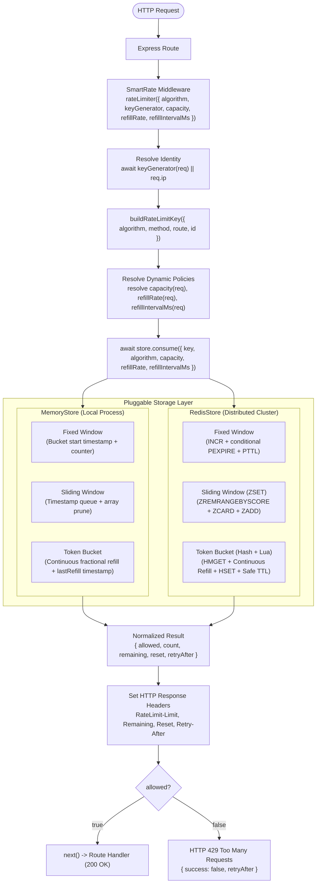

# SmartRate v5

A production-ready distributed rate limiting middleware for Express.js supporting **Token Bucket + Controlled Burst**, **Rolling Sliding Window**, and **Fixed Window** algorithms, **Custom Client Identity** (API Key, User ID, Multi-Tenant), and **Dynamic Tier-Based Policies**.

SmartRate provides high-performance, zero-dependency in-memory rate limiting and distributed, atomic Redis-backed rate limiting across multiple application instances.

> **Repository Note:** The project is named **SmartRate** (npm package `smart-rate`), hosted in the [RateShield](https://github.com/Anivesh91/RateShield) repository.

```javascript
import express from 'express';
import { rateLimiter, RedisStore } from 'smart-rate';

const app = express();

// 1. Token Bucket + Burst Control: Allows 20-request immediate bursts, sustained 5 req/sec
app.use(
  '/api',
  rateLimiter({
    algorithm: 'token-bucket',
    capacity: 20,                // Maximum burst capacity
    refillRate: 5,               // Sustained refill rate
    refillIntervalMs: 1000,      // Refill interval (5 tokens per 1000ms)
    keyGenerator: (req) => req.headers['x-api-key']
  })
);

// 2. Rolling Sliding Window: Strictest boundary enforcement for auth
app.post(
  '/auth/login',
  rateLimiter({
    algorithm: 'sliding-window',
    limit: 5,
    windowMs: 60_000
  }),
  loginHandler
);

// 3. Fixed Window: Default high-throughput public endpoint protection
app.get(
  '/public/status',
  rateLimiter({ limit: 100, windowMs: 60_000 }),
  statusHandler
);
```

---

## What's New in SmartRate v5

SmartRate v5 brings production-grade **Token Bucket and Burst Control** semantics across both distributed (Redis) and single-instance (Memory) deployments:

* **Token Bucket + Controlled Burst (`algorithm: 'token-bucket'`)**:
  - Independent control over immediate burst capacity (`capacity`) and sustained replenishment rate (`refillRate`, `refillIntervalMs`).
  - Solves the classic problem where frontend clients legitimately fire parallel bursts (e.g. 20 requests on page load) that would be blocked by a strict sliding window limit.
* **Custom Refill Intervals (`refillIntervalMs`)**:
  - Developers can specify schedules such as "100 tokens per 60,000ms" ($100/\text{min}$) cleanly without loss of fractional continuous refill precision.
* **Continuous Millisecond-Resolution Refill**:
  - Tokens replenish lazily and continuously according to exact elapsed time:
    $$\text{refillPerMs} = \frac{\text{refillRate}}{\text{refillIntervalMs}}$$
    $$\text{tokensToAdd} = \Delta t \times \text{refillPerMs}$$
    $$currentTokens = \min(capacity, tokens + \text{tokensToAdd})$$
* **Option C `RateLimit-Reset` & HTTP Retry Semantics**:
  - For Token Bucket, `RateLimit-Reset` does not represent a fixed-window boundary.
  - **On Allowed Responses (HTTP 2xx)**: `RateLimit-Reset` indicates seconds until the bucket reaches full capacity (when full burst capacity is restored), including when `RateLimit-Remaining` is zero.
  - **On Blocked Responses (HTTP 429)**: `RateLimit-Reset` indicates the next request-eligibility point, matching `Retry-After` ($\lceil (1 - currentTokens) / \text{refillPerMs} / 1000 \rceil$).
  - Aligns with IETF RateLimit Header specifications where `Retry-After` takes precedence on throttled responses.
* **Storage Cleanup TTL vs. Continuous Refill**:
  - **`TTL = cleanup only`**: In Redis, sliding key expiration ($2 \times \text{fullRefillTime}$, min 60s) refreshes on every request to prune abandoned keys.
  - **`TTL ≠ refill mechanism`**: Token accrual is strictly determined by elapsed continuous time ($\Delta t \times \text{refillPerMs}$).
* **Zero-Leak Memory Sweeper Eviction**:
  - In-memory periodic sweepers only evict inactive buckets if they are mathematically 100% full at the exact time of sweep, ensuring no token accrual history is lost.
* **Standard 1 Request = 1 Token**:
  - Standard V5 rate limiting costs 1 token per request (while preserving backward-compatible support for weighted costs).
* **Multi-Instance Distributed Verification**:
  - Verified across multiple independent Express and Redis client instances with atomic Lua execution and zero race conditions under 50-request parallel bursts.

---

## Algorithm Comparison Matrix

| Dimension | Fixed Window (`'fixed-window'`) | Sliding Window (`'sliding-window'`) | Token Bucket (`'token-bucket'`) |
| :--- | :--- | :--- | :--- |
| **Boundary Burst Prevention** | ❌ Prone to $2 \times N$ bursts at boundaries | ✅ **Strictly eliminated** in rolling window | ✅ **Controlled burst** up to `capacity`, sustained by `refillRate` |
| **Traffic Shaping** | Hard reset each window | Rolling window cutoff | **Continuous smooth refill** over time |
| **Refill Schedule** | Window duration (`windowMs`) | Rolling interval (`windowMs`) | **Custom interval** (`refillIntervalMs`, default 1s) |
| **Memory Complexity** | **$O(1)$** per key (counter + timestamp) | **$O(N)$** per key ($N$ timestamps in ZSET) | **$O(1)$** per key (tokens + lastRefill hash) |
| **HTTP Reset Semantics** | Window expiry boundary | Oldest rolling timestamp eviction | **Option C**: Time to full burst (allowed) or next request (429) |
| **Redis Data Structure** | String counter (`INCR`) | Sorted Set (`ZSET`) | Hash (`HMGET` / `HSET`) + Atomic Lua |
| **Recommended Use Case** | Coarse public DDoS prevention | High-security auth / login endpoints | **SaaS APIs, bursty frontends, background webhook queues** |

---

## Architecture Overview



---

## Token Bucket Mechanics & Formulas

Tokens refill continuously according to the exact elapsed milliseconds since the previous evaluation:

$$\text{refillPerMs} = \frac{\text{refillRate}}{\text{refillIntervalMs}}$$

$$\Delta t = \max(0,\, now - lastRefillTimestamp)$$

$$\text{tokensToAdd} = \Delta t \times \text{refillPerMs}$$

$$currentTokens = \min(capacity,\, prevTokens + \text{tokensToAdd})$$

### Standard Request Consumption (Cost = 1)
- **If $currentTokens \ge 1$**:
  $$currentTokens = currentTokens - 1 \implies \text{Allowed (HTTP 200)}$$
  $$\text{RateLimit-Remaining} = \lfloor currentTokens \rfloor$$
  $$\text{RateLimit-Reset} = \max\left(1,\, \left\lceil \frac{capacity - currentTokens}{\text{refillPerMs} \times 1000} \right\rceil\right)$$
- **If $currentTokens < 1$**:
  $$\text{neededTokens} = 1 - currentTokens$$
  $$\text{waitMs} = \frac{\text{neededTokens}}{\text{refillPerMs}}$$
  $$\text{Retry-After} = \max\left(1,\, \left\lceil \frac{\text{waitMs}}{1000} \right\rceil\right) \implies \text{Blocked (HTTP 429)}$$
  $$\text{RateLimit-Reset} = \text{Retry-After}$$

> **IETF Compliance Note:** For Token Bucket, `RateLimit-Reset` does not represent a fixed-window boundary. On allowed responses it indicates time to full bucket restoration; on blocked responses it indicates the next request-eligibility point.

---

## Usage Guide

### 1. Token Bucket with Burst Control & Custom Refill Interval

```javascript
import express from 'express';
import { rateLimiter } from 'smart-rate';

const app = express();

// Allow bursts up to 30 requests, refilling at 100 requests per minute
app.use(
  '/api/search',
  rateLimiter({
    algorithm: 'token-bucket',
    capacity: 30,                // Immediate burst allowance
    refillRate: 100,             // 100 tokens
    refillIntervalMs: 60_000,    // Refilled continuously over 60 seconds (1 token / 600ms)
    keyGenerator: (req) => req.headers['x-api-key']
  })
);
```

### 2. Distributed Token Bucket with Redis

```javascript
import express from 'express';
import { createClient } from 'redis';
import { rateLimiter, RedisStore } from 'smart-rate';

const app = express();

const redisClient = createClient({ url: 'redis://localhost:6379' });
await redisClient.connect();

const store = new RedisStore({ client: redisClient });

app.use(
  '/api',
  rateLimiter({
    store,
    algorithm: 'token-bucket',
    capacity: 20,                // 20 requests burst
    refillRate: 2,               // 2 requests refilled per second
    refillIntervalMs: 1000,
    keyGenerator: (req) => req.headers['x-user-id']
  })
);
```

### 3. Multi-Tier SaaS API with Token Bucket

```javascript
import express from 'express';
import { rateLimiter } from 'smart-rate';

const app = express();

const TIER_CONFIG = {
  free: { capacity: 5, refillRate: 1, refillIntervalMs: 1000 },
  pro: { capacity: 25, refillRate: 5, refillIntervalMs: 1000 },
  enterprise: { capacity: 100, refillRate: 20, refillIntervalMs: 1000 }
};

app.use(
  '/api',
  (req, res, next) => {
    const requestedTier = req.user?.tier;
    const tier = Object.hasOwn(TIER_CONFIG, requestedTier) ? requestedTier : 'free';
    req.rateLimitPolicy = TIER_CONFIG[tier];
    next();
  },
  rateLimiter({
    algorithm: 'token-bucket',
    keyGenerator: (req) => req.headers['x-api-key'],
    capacity: (req) => req.rateLimitPolicy.capacity,
    refillRate: (req) => req.rateLimitPolicy.refillRate,
    refillIntervalMs: (req) => req.rateLimitPolicy.refillIntervalMs
  })
);
```

---

## Rate-Limit Response Headers

Every rate-limited route attaches standard HTTP rate-limiting headers with Option C semantics:

| Header | Example | Description |
| :--- | :--- | :--- |
| `RateLimit-Limit` | `20` | Configured burst capacity or window quota |
| `RateLimit-Remaining` | `15` | Current integer tokens remaining (strictly 0 when blocked) |
| `RateLimit-Reset` | `3` | **Allowed (200)**: Seconds until bucket is 100% full again.<br/>**Blocked (429)**: Seconds until enough tokens exist for next request (`Reset === Retry-After`). |
| `Retry-After` | `1` | *(Emitted on HTTP 429 only)* Exact seconds until the client is eligible to retry |

---

## Demos & Interactive Scripts

### 1. Token Bucket & Burst Control Demo (v5)
```bash
npm run demo:burst
# Or: node examples/express-demo/burst-demo.js
```
Automated CLI simulation and live Express server showcasing:
1. Rapid burst of 5 requests allowed (`200 OK`, remaining $4 \to 0$).
2. Immediate 6th request throttled with HTTP 429 (`Retry-After: 1s`, `RateLimit-Reset: 1s`).
3. Continuous recovery after waiting 1 second $\to$ next request succeeds (`200 OK`).

### 2. SaaS Multi-Tier Dynamic Policy Demo (v4)
```bash
npm run demo:saas
# Or: node examples/express-demo/saas-demo.js
```

### 3. Fixed vs. Sliding Window Comparison Demo (v3)
```bash
npm run demo:sliding
# Or: node examples/express-demo/sliding-demo.js
```

### 4. Distributed Multi-Instance Redis Demo (v2)
```bash
npm run demo:multi
# Or: node examples/express-demo/multi-instance.js
```

---

## Verification & Test Catalog (110 Tests)

Run the full automated test suite:

```bash
npm test
```

### Test Suites Breakdown (110 Tests across 14 Files)

1. **`tests/tokenBucket.recovery.test.js`** (11 tests) — **[v5]**
   - Option C `RateLimit-Reset` semantics in MemoryStore and RedisStore.
   - Memory $\leftrightarrow$ Redis HTTP header parity.
   - Multi-instance distributed Token Bucket across separate client and store instances.
   - Identity composition: User ID, API Key, Multi-Tenant composite keys, IP fallback.
   - Full HTTP recovery cycle: `200 OK` (burst) $\to$ `429 Too Many Requests` $\to$ wait `Retry-After` $\to$ `200 OK` (recovered).
   - 50-request parallel burst concurrency verification under RedisStore.
2. **`tests/tokenBucket.memory.test.js`** (16 tests) — **[v4/v5]**
   - Fail-fast parameter validation for `capacity`, `refillRate`, `refillIntervalMs`.
   - Continuous in-memory refill math and capacity ceiling clamping.
   - Custom `refillIntervalMs` verification (100 tokens per 60,000ms).
   - Smart `Retry-After` calculation for 1 token.
   - Mathematical zero-leak memory sweeper eviction.
3. **`tests/tokenBucket.redis.test.js`** (10 tests) — **[v4/v5]**
   - Distributed Redis Token Bucket mechanics and continuous Lua refill math.
   - Custom `refillIntervalMs` in Redis Lua.
   - Safe sliding activity TTL for storage cleanup.
   - 50-request parallel concurrency stress test (zero race conditions).
4. **`tests/rateLimiter.test.js`** (14 tests) — **[v1]**
   - Option validation, Fixed Window enforcement, IP/route/method isolation, header generation.
5. **`tests/slidingWindow.memory.test.js`** (10 tests) — **[v3]**
   - In-memory rolling queue mechanics, half-open interval boundaries, dynamic reset.
6. **`tests/redisStore.test.js`** (9 tests) — **[v2]**
   - RedisStore client injection, eval vs sendCommand fallback, error handling.
7. **`tests/keyGenerator.test.js`** (8 tests) — **[v4]**
   - Custom identity extraction, multi-tenant composite keys, IP fallback.
8. **`tests/dynamicPolicy.test.js`** (7 tests) — **[v4]**
   - Dynamic per-request capacity, refillRate, cost functions.
9. **`tests/distributed.test.js`** (5 tests) — **[v3]**
   - Cross-instance shared state verification across Express instances.
10. **`tests/slidingWindow.redis.test.js`** (5 tests) — **[v3]**
    - Redis Sorted Set (ZSET) atomic Lua script execution.
11. **`tests/memoryStore.test.js`** (5 tests) — **[v1]**
    - Memory store unit tests and cleanup sweepers.
12. **`tests/concurrency.test.js`** (4 tests) — **[v3]**
    - Concurrency tests for Fixed Window and Sliding Window.
13. **`tests/redis.integration.test.js`** (3 tests) — **[v2]**
    - Redis fixed window TTL and expiration.
14. **`tests/boundaryBurst.test.js`** (3 tests) — **[v3]**
    - Boundary-burst verification (fixed vs sliding window).

---

## Roadmap & Version History

* **v1.0.0**: In-memory Fixed Window rate limiter for Express.js.
* **v2.0.0**: Pluggable storage architecture, distributed `RedisStore`, and atomic Lua script execution.
* **v3.0.0**: Rolling Sliding Window (`algorithm: 'sliding-window'`) with Redis Sorted Sets (ZSET) and boundary-burst elimination.
* **v4.0.0**: Custom client identity via `keyGenerator(req)`, dynamic tier-based policies, and weighted request costs.
* **v5.0.0 (Current)**:
  - Token Bucket + Controlled Burst rate limiting (`algorithm: 'token-bucket'`).
  - Independent burst capacity (`capacity`) and continuous sustained replenishment (`refillRate`, `refillIntervalMs`).
  - Sub-second continuous mathematical refill ($\text{refillPerMs} = \text{refillRate} / \text{refillIntervalMs}$).
  - Option C `RateLimit-Reset` and smart `Retry-After` HTTP recovery semantics.
  - Safe sliding Redis TTL for storage cleanup ($2 \times \text{fullRefillTime}$, min 60s).
  - Mathematical zero-leak memory sweeper eviction.
  - Multi-instance distributed verification across independent Redis client instances.
  - Interactive Token Bucket & Burst Control Express demo (`npm run demo:burst`).
* **v6.0.0 (Planned)**: Circuit breakers and configurable fail-open resilience engines.
* **v7.0.0 (Planned)**: Prometheus and OpenTelemetry metrics instrumentation.

---

## License

MIT © [Anivesh](https://github.com/Anivesh91)
