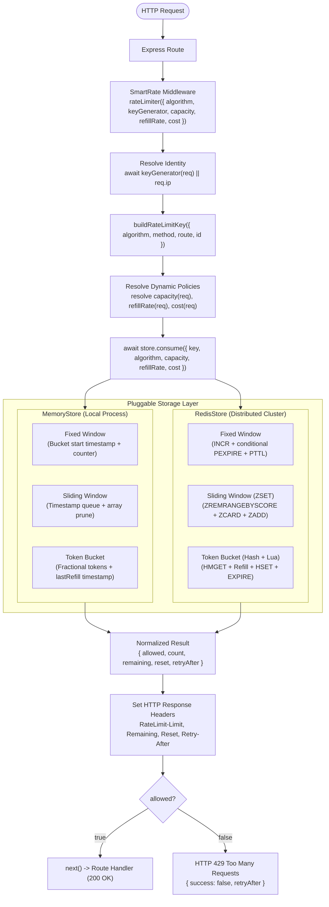

# SmartRate v4

A production-ready rate limiting middleware for Express.js supporting **Fixed Window**, **Rolling Sliding Window**, and **Token Bucket** algorithms, **Custom Client Identity** (API Key, User ID, Multi-Tenant), and **Dynamic Tier-Based Policies**.

SmartRate provides high-performance, zero-dependency in-memory rate limiting and distributed, atomic Redis-backed rate limiting across multiple application instances.

> **Repository Note:** The project is named **SmartRate** (npm package `smart-rate`), hosted in the [RateShield](https://github.com/Anivesh91/RateShield) repository.

```javascript
import express from 'express';
import { rateLimiter, RedisStore } from 'smart-rate';

const app = express();

// 1. Token Bucket: Tier-based SaaS policy with custom identity and weighted costs
app.use(
  '/api',
  rateLimiter({
    algorithm: 'token-bucket',
    keyGenerator: (req) => req.headers['x-api-key'],
    capacity: (req) => (req.user?.tier === 'pro' ? 50 : 10),
    refillRate: (req) => (req.user?.tier === 'pro' ? 10 : 2),
    cost: (req) => (req.path.startsWith('/api/export') ? 5 : 1)
  })
);

// 2. Rolling Sliding Window: Strictest boundary enforcement for auth
app.post(
  '/auth/login',
  rateLimiter({
    algorithm: 'sliding-window',
    limit: 5,
    windowMs: 60_000
  }),
  loginHandler
);

// 3. Fixed Window: Default high-throughput public endpoint protection
app.get(
  '/public/status',
  rateLimiter({ limit: 100, windowMs: 60_000 }),
  statusHandler
);
```

---

## What's New in SmartRate v4

SmartRate v4 brings production-grade SaaS rate limiting primitives:

* **Token Bucket Algorithm (`algorithm: 'token-bucket'`)**:
  - Allows natural bursts of traffic up to `capacity` while enforcing a sustained maximum rate through continuous `refillRate` (tokens/sec).
  - Continuous mathematical refill: tokens replenish lazily based on elapsed time ($\Delta t = now - lastRefill$) without any background timers or cron overhead.
  - **$O(1)$ Constant Memory Overhead**: Unlike sliding window logs which scale with request volume ($O(N)$), token buckets store only two numbers (`tokens` and `lastRefill`), saving immense memory under high traffic.
* **Custom Client Identity & Multi-Tenancy (`keyGenerator(req)`)**:
  - Rate limit by API Key, Authenticated User ID, Organization/Tenant ID, or composite keys (`tenant_123:user_456`).
  - Safe fallback: Automatically extracts client IP if `keyGenerator` is omitted or returns null/empty.
* **Dynamic & Tier-Based Policies**:
  - Configure `limit`, `windowMs`, `capacity`, `refillRate`, and `cost` as dynamic functions `(req) => ...` evaluated per request.
  - Seamlessly assign different quotas to Free, Pro, and Enterprise tiers within the exact same middleware.
* **Weighted Request Costs (`cost: (req) => ...`)**:
  - Charge variable tokens based on operation weight (e.g. lightweight GET consumes 1 token; heavy analytical export consumes 5 tokens).
* **Distributed Redis Token Bucket with Atomic Lua (`src/scripts/tokenBucket.lua`)**:
  - Atomic Redis Hash execution (`HMGET` -> continuous refill calculation -> token deduction -> `HSET` -> rolling `EXPIRE`).
  - Single network roundtrip with zero race conditions under concurrent load.
  - Dynamic key expiration prevents Redis memory leaks for idle users.
* **100% Backwards Compatibility**:
  - Fully supports all v1, v2, and v3 configurations.
  - Fixed Window remains default when `algorithm` is omitted.
  - Token Bucket accepts direct `{ capacity, refillRate, cost }` or legacy alias `{ limit, windowMs }`.

---

## Algorithm Comparison Matrix

| Dimension | Fixed Window (`'fixed-window'`) | Sliding Window (`'sliding-window'`) | Token Bucket (`'token-bucket'`) |
| :--- | :--- | :--- | :--- |
| **Boundary Burst Prevention** | ❌ Prone to $2 \times N$ bursts at boundaries | ✅ **Strictly eliminated** in rolling window | ✅ **Bounded burst** strictly capped at `capacity` |
| **Traffic Shaping** | Hard reset each window | Rolling window cutoff | Continuous smooth refill over time |
| **Memory Complexity** | **$O(1)$** per key (counter + timestamp) | **$O(N)$** per key ($N$ timestamps in ZSET) | **$O(1)$** per key (tokens + lastRefill hash) |
| **Weighted Request Cost** | ❌ Not supported (1 req = 1 count) | ❌ Not supported | ✅ **Fully supported** (`cost: (req) => ...`) |
| **Redis Data Structure** | String counter (`INCR`) | Sorted Set (`ZSET`) | Hash (`HMGET` / `HSET`) |
| **Recommended Use Case** | Coarse public DDoS prevention | High-security auth / login endpoints | **SaaS APIs, multi-tier quotas, heavy data APIs** |

---

## Architecture Overview



---

## Token Bucket Mechanics & Formula

Tokens refill continuously according to the exact elapsed time since the previous request:

$$\Delta t = \max(0,\, now - lastRefill)$$

$$tokensToAdd = \frac{\Delta t}{1000} \times refillRate$$

$$currentTokens = \min(capacity,\, prevTokens + tokensToAdd)$$

- If $currentTokens \ge cost$:
  $$currentTokens = currentTokens - cost \implies \text{Allowed (HTTP 200)}$$
- If $currentTokens < cost$:
  $$retryAfter = \max\left(1,\, \left\lceil \frac{cost - currentTokens}{refillRate} \right\rceil\right) \implies \text{Blocked (HTTP 429)}$$

---

## Usage Guide

### 1. Multi-Tier SaaS API with Token Bucket

```javascript
import express from 'express';
import { rateLimiter, MemoryStore } from 'smart-rate';

const app = express();

const TIER_CONFIG = {
  free: { capacity: 5, refillRate: 1 },
  pro: { capacity: 25, refillRate: 5 },
  enterprise: { capacity: 100, refillRate: 20 }
};

app.use(
  '/api',
  rateLimiter({
    algorithm: 'token-bucket',
    keyGenerator: (req) => req.headers['x-api-key'],
    capacity: (req) => {
      const tier = req.user?.tier || 'free';
      return TIER_CONFIG[tier].capacity;
    },
    refillRate: (req) => {
      const tier = req.user?.tier || 'free';
      return TIER_CONFIG[tier].refillRate;
    },
    cost: (req) => (req.path === '/api/export' ? 5 : 1)
  })
);
```

### 2. Distributed Token Bucket with Redis

```javascript
import express from 'express';
import { createClient } from 'redis';
import { rateLimiter, RedisStore } from 'smart-rate';

const app = express();

const redisClient = createClient({ url: 'redis://localhost:6379' });
await redisClient.connect();

const store = new RedisStore({ client: redisClient });

app.use(
  '/api',
  rateLimiter({
    store,
    algorithm: 'token-bucket',
    capacity: 20,
    refillRate: 2, // 2 tokens refilled per second
    keyGenerator: (req) => req.headers['x-user-id']
  })
);
```

---

## Rate-Limit Response Headers

Every rate-limited route attaches standard HTTP rate-limiting headers:

| Header | Example | Description |
| :--- | :--- | :--- |
| `RateLimit-Limit` | `20` | Configured bucket capacity or window quota |
| `RateLimit-Remaining` | `15` | Current integer tokens remaining (never drops below 0) |
| `RateLimit-Reset` | `3` | Seconds until the bucket is completely full again |
| `Retry-After` | `2` | *(Emitted on HTTP 429 only)* Seconds until enough tokens refill to permit the request |

---

## Demos & Interactive Scripts

### 1. SaaS Multi-Tier & Weighted Cost Demo (v4)
```bash
npm run demo:saas
# Or: node examples/express-demo/saas-demo.js
```
* Free Tier: `curl -H "x-api-key: ak_free_123" http://localhost:3003/api/data`
* Pro Tier: `curl -H "x-api-key: ak_pro_456" http://localhost:3003/api/data`
* Heavy Export: `curl -X POST -H "x-api-key: ak_ent_789" http://localhost:3003/api/export`

### 2. Fixed vs. Sliding Window Comparison Demo (v3)
```bash
npm run demo:sliding
# Or: node examples/express-demo/sliding-demo.js
```

### 3. Distributed Multi-Instance Redis Demo (v2)
```bash
npm run demo:multi
# Or: node examples/express-demo/multi-instance.js
```

---

## Verification & Test Catalog (92 Tests)

Run the full automated test suite:

```bash
npm test
```

### Test Suites Breakdown

1. **`tests/dynamicPolicy.test.js`** (6 tests) — **[v4]**
   - Free vs Pro tier quota enforcement under Fixed Window.
   - Dynamic sliding window quotas based on user role.
   - Dynamic Token Bucket capacity and refill rates in MemoryStore and RedisStore.
   - Dynamic weighted request costs for heavy operations.
   - Fail-fast error propagation to Express error handlers.
2. **`tests/tokenBucket.redis.test.js`** (7 tests) — **[v4]**
   - Distributed Redis Token Bucket mechanics and continuous refill.
   - 50-request parallel concurrency stress tests (zero quota overshoots).
   - Multi-client parallel isolation.
   - Accurate RateLimit and Retry-After headers.
3. **`tests/tokenBucket.memory.test.js`** (12 tests) — **[v4]**
   - Option validation and fail-fast checks.
   - Burst allowance and empty bucket blocking.
   - Continuous fractional refill and capacity clamping.
   - Weighted costs and idle sweeper eviction.
4. **`tests/keyGenerator.test.js`** (8 tests) — **[v4]**
   - Custom identity extraction (API keys, user IDs, headers).
   - Multi-tenant key namespacing (`tenant:user`).
   - Graceful fallback to client IP.
5. **`tests/boundaryBurst.test.js`** (3 tests) — **[v3]**
   - Boundary burst elimination in Memory and Redis.
6. **`tests/concurrency.test.js`** (4 tests) — **[v3]**
   - Concurrency tests for Fixed Window and Sliding Window.
7. **`tests/distributed.test.js`** (5 tests) — **[v3]**
   - Cross-instance shared state verification across Express instances.
8. **`tests/slidingWindow.memory.test.js`** (11 tests) — **[v3]**
   - In-memory rolling queue mechanics, half-open boundaries, dynamic reset.
9. **`tests/slidingWindow.redis.test.js`** (5 tests) — **[v3]**
   - Redis Sorted Set (ZSET) atomic Lua script execution.
10. **`tests/rateLimiter.test.js`** (13 tests) — **[v1]**
    - Fixed window mechanics, Express middleware integration.
11. **`tests/redisStore.test.js`** & **`tests/redis.integration.test.js`** (12 tests) — **[v2]**
    - Redis connection, atomic Lua execution, TTL eviction.
12. **`tests/memoryStore.test.js`** (5 tests) — **[v1]**
    - Memory store unit tests and cleanup sweepers.

---

## Roadmap & Version History

* **v1.0.0**: In-memory Fixed Window rate limiter for Express.js.
* **v2.0.0**: Pluggable storage architecture, distributed `RedisStore`, and atomic Lua script execution.
* **v3.0.0**: Rolling Sliding Window (`algorithm: 'sliding-window'`) with Redis Sorted Sets (ZSET) and boundary-burst elimination.
* **v4.0.0 (Current)**:
  - Token Bucket rate limiting algorithm (`algorithm: 'token-bucket'`).
  - Atomic Redis Hash storage engine with continuous mathematical refill.
  - Custom client identity via `keyGenerator(req)`.
  - Dynamic tier-based policies and weighted request costs (`cost`).
  - Complete SaaS multi-tier Express demo.
* **v5.0.0 (Planned)**: Dynamic route template normalization (`/users/:id`).
* **v6.0.0 (Planned)**: Circuit breakers and configurable fail-open resilience engines.
* **v7.0.0 (Planned)**: Prometheus and OpenTelemetry metrics instrumentation.

---

## License

MIT © [Anivesh](https://github.com/Anivesh91)
